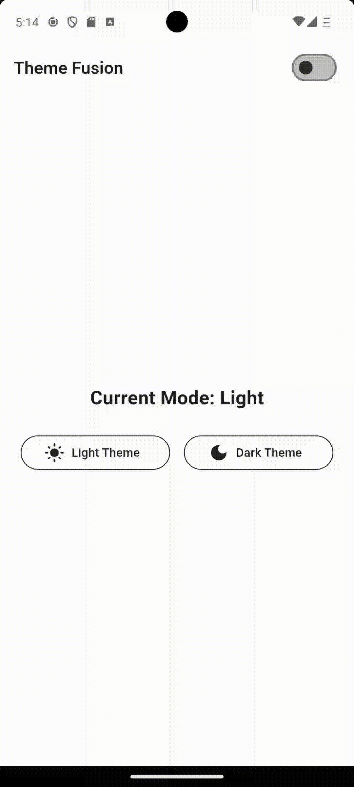
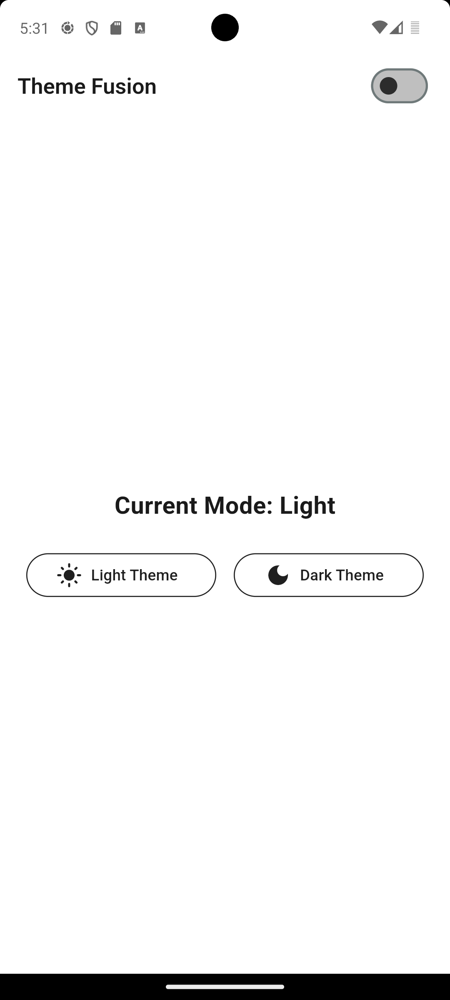
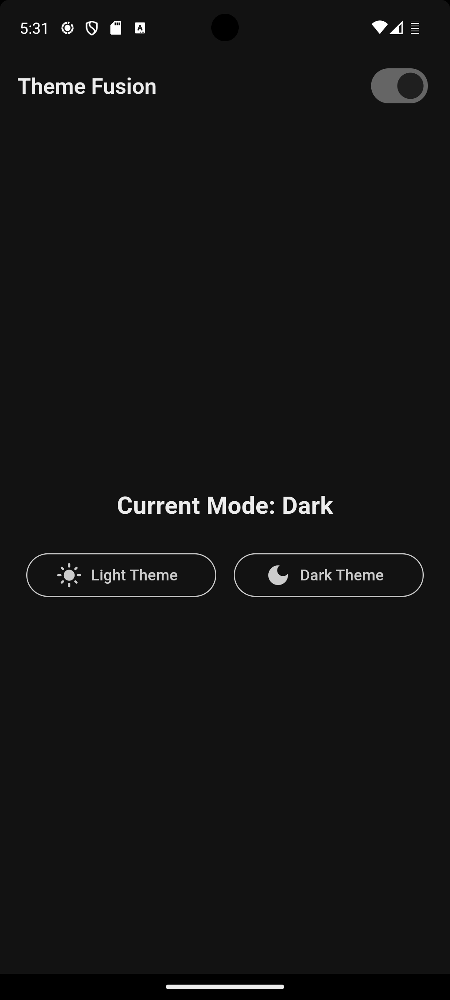

```markdown
# 🌗 theme_fusion

[](https://pub.dev/packages/theme_fusion)
[](https://github.com/Gokul132000/theme_fusion)


**theme_fusion** is a lightweight and developer-friendly package for real-time dynamic theme switching between **Light** and **Dark** modes — built with ❤️ by [Gokulram M.](https://github.com/Gokul132000)

---

## 🎥 Live Demo



---

## 🖼️ Theme Preview

### 🌞 Light Mode  


### 🌚 Dark Mode  


---

## ✨ Features

- 🔁 Real-time **light/dark theme switching**
- 💡 Define your own theme color models
- 🧠 Access and control theme globally
- 🧊 Smooth rebuilds without boilerplate
- 📦 SharedPreferences for persistent themes
- 💻 Supports Android, iOS, Web, and Desktop

---

## 🚀 Installation

Add to your `pubspec.yaml`:

```yaml
dependencies:
  theme_fusion: ^1.0.0
```

Then run:

```bash
flutter pub get
```

---

## 🧪 Getting Started

### ✅ Step 1: Define your custom theme class

```dart
class AppTheme extends BaseThemeColors {
  @override
  final Color primary;
  @override
  final Color background;
  @override
  final Color text;
// Add your own custom color properties here if needed
  final Color divider;
  final Color button;

  const AppTheme({
    required this.primary,
    required this.background,
    required this.text,
    required this.divider,
    required this.button,
  });
}
```

---

### ✅ Step 2: Declare light and dark theme values

```dart
const lightTheme = AppTheme(
  primary: Color(0xFF1F1F1F),
  background: Color(0xFFFFFFFF),
  text: Color(0xFF1A1A1A),
  divider: Color(0xFF2C2C2C),
  button: Color(0xFF1F1F1F),
);

const darkTheme = AppTheme(
  primary: Color(0xFF1F1F1F),
  background: Color(0xFF121212),
  text: Color(0xFFECECEC),
  divider: Color(0xFFE0E0E0),
  button: Color(0xFFCCCCCC),
);
```

---

### ✅ Step 3: Wrap your app with `ThemeFusionApp`

> ⚠️ Do **not** use `const` before the builder to allow dynamic rebuilding.

```dart
void main() {
  runApp(
    ThemeFusionApp<AppTheme>(
      light: lightTheme,
      dark: darkTheme,
      builder: (context) => MyApp(), // don't use const here
    ),
  );
}
```

---

### ✅ Step 4: Global theme access

```dart
AppTheme get theme => themeFusionColor<AppTheme>();
bool get isDarkTheme => themeFusion.isDark;

final themeToggle = themeFusion.toggle;
final setLightTheme = themeFusion.setLightMode;
final setDarkTheme = themeFusion.setDarkMode;
```

Use these anywhere to access the theme or change it on the fly.

---

### ✅ Step 5: Apply in your UI

```dart
MaterialApp(
  theme: ThemeData(
    scaffoldBackgroundColor: theme.background,
    colorScheme: ColorScheme.fromSeed(
      seedColor: theme.primary,
      brightness: isDarkTheme ? Brightness.dark : Brightness.light,
    ),
    appBarTheme: AppBarTheme(
      backgroundColor: theme.background,
      titleTextStyle: TextStyle(
        color: theme.text,
        fontWeight: FontWeight.w600,
        fontSize: 20,
      ),
    ),
  ),
  home: Scaffold(
    appBar: AppBar(
      title: const Text("Theme Fusion"),
      actions: [
        Switch(
          value: isDarkTheme,
          onChanged: (_) => themeToggle(),
        ),
      ],
    ),
    body: Center(
      child: Text(
        "Current Mode: ${isDarkTheme ? "Dark" : "Light"}",
        style: TextStyle(color: theme.text),
      ),
    ),
  ),
);
```

---

## 📁 Suggested Folder Structure

```
lib/
├── main.dart
├── theme/
│   └── app_theme.dart
```

---

## 👨‍💻 Created by

**Gokulram M.**  
[GitHub](https://github.com/Gokul132000) • [Portfolio](https://gokul132000.github.io)

---

## 📄 License

MIT License • See [`LICENSE`](LICENSE) file for details.
```
